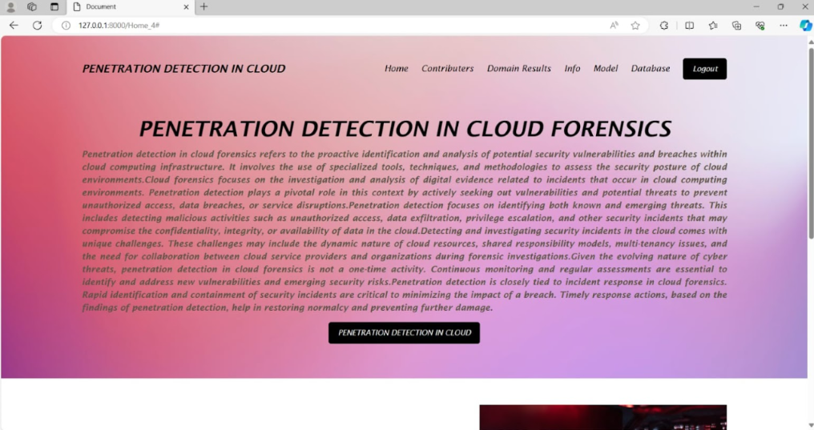
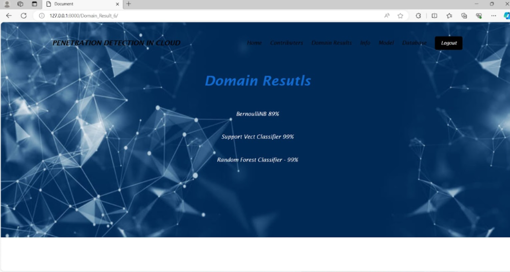

# 🌐 Penetration Detection In Cloud Forensics Using Artificial Intelligence Techniques

This project aims to detect penetration in cloud forensics using various artificial intelligence techniques. The project is divided into four main modules:

1. **🧹 Data Preprocessing and Data Cleaning**
2. **📊 Data Visualization and Data Analysis**
3. **🌳 Decision Tree Algorithm**
4. **🔍 Support Vector Algorithm**

## 📂 Modules

### 1. 🧹 Data Preprocessing and Data Cleaning
This module focuses on preparing the raw data for analysis. It involves:
- Removing duplicates
- Handling missing values
- Normalizing data

### 2. 📊 Data Visualization and Data Analysis
In this module, we visualize the data to gain insights and understand patterns. Techniques used include:
- Plotting histograms
- Scatter plots
- Correlation matrices

### 3. 🌳 Decision Tree Algorithm
This module implements the decision tree algorithm to classify and predict potential penetration attempts.

### 4. 🔍 Support Vector Algorithm
This module uses the support vector machine (SVM) algorithm to classify data and identify penetration patterns.

## 🖼️ Screenshots

### 🔐 Login Page
Here is the login page of the application:


### 🏠 Homepage
After logging in, you will see the homepage:



### 📈 Result Page
The result page displays the outcomes of the analysis:



## 🚀 How to Run the Project

1. Clone the repository:
    ```sh
    git clone https://github.com/yourusername/Penetration-Detection-In-Cloud-Forensics-Using-Artificial-Intelligence-Techniques.git
    ```
2. Navigate to the project directory:
    ```sh
    cd Penetration-Detection-In-Cloud-Forensics-Using-Artificial-Intelligence-Techniques
    ```
3. Install the required dependencies:
    ```sh
    pip install -r requirements.txt
    ```
4. Run the application:
    ```sh
    python app.py
    ```

## 📧 Contact
For any queries or contributions, please contact:
- **Sharath Kumar**: sharath88528@gmail.com
